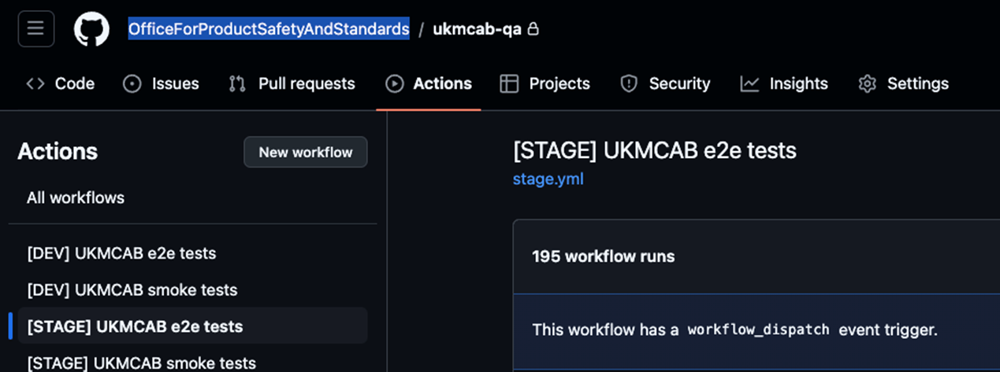

# UKMCAB Project - QA Handover Document
-----------------
## 1. Introduction
This document outlines the QA process for the UKMCAB project. It serves as a guide for ensuring consistency in the quality assurance of each release, detailing the workflow from the point when a user story is marked as ready for QA to the final release to production.

## 2. QA Process
1. User Story/Task Review & Assignment:
    - Once the development team has completed a user story or task, it is reviewed.The task is moved to the 'Ready for QA' column in the project management board. A QA is assigned to the task, and this is communicated to the QA to begin testing.

2.	Deployment to Stage Environment:
    - The development branch (Dev branch) is deployed to the STAGE environment. Note: Due to limited allowance on GitHub workflow actions, we group ready-for-QA tickets and deploy them all at once to minimize workflow action usage.

3.	Triggering Full Regression on Stage:
    - A full regression suite is triggered manually against the STAGE environment. Any bugs detected during this regression are raised as individual bug tickets and analyzed.

4.	Analyzing Regression Results & Bug Reporting:
    - The QA analyzes the regression suite report. If any bugs are found, they are reported via the Jira and communicated to the relevant developers and Product Owner for further action.

5.	Automation Suite Refactoring:
    - The automation suite is refactored to accommodate new changes and features added during the development cycle. Improvements are also made to increase test coverage where necessary.

6.	Manual Testing of User Stories:
    - Each user story is tested manually based on its acceptance criteria and edge cases. Bugs identified during manual testing are reported and communicated with the Product Owner for deeper analysis.

7.	Bug Fixing on Dev Branch:
    - Developers address any bugs found during the testing process. Fixes are committed to the dev branch, and a new build is created.

8.	Redeployment to Stage Environment:
    - Once the bug fixes are completed, a new build is deployed to the STAGE environment.

9.	Retesting of Bug Fixes:
    - Both automation and manual test cases are rerun to ensure that all identified bugs have been fixed correctly. If the bug fixes affect the automation suite, the automation suite is updated accordingly.

10.	Full Regression After Bug Fixes:
    - A full regression is run again after all the bug fixes have been deployed. This ensures that no new issues were introduced by the bug fixes and that the system is stable.

11.	Release Preparation:
    - If no further issues are found, a code cut is performed on the dev branch, creating a release branch with a release tag.

12.	Deployment to Pre-Production Environment:
    - The release branch is deployed to the pre-production environment (Pre-Prod) for testing.

13.	Testing on Pre-Prod:
    - The QA conducts a final round of testing on the release candidate in Pre-Prod. This includes exploratory testing, and other sanity checks.

14.	Approval for Production Release:
    - Once testing on Pre-Prod passes without issues, the QA gives the green light to proceed with the production release. The team is informed that the release is ready for deployment to the Production environment.

## 3. Tools & Resources
- GitHub: Used for version control, development branches, and deploying builds.
- GitHub Workflow Actions: Limited usage requires careful grouping of deployments to optimize the use of actions.
- Jira: Used for tracking user stories, tasks, bugs, and overall workflow management.
- STAGE Environment: Main testing environment for regression and initial testing.
- Pre-Prod Environment: Used for release candidate testing before the final deployment to production.
- Automation Suite: This is Cypress framework with Mocha. It contains automated test cases that are triggered for regression, bugs, and new feature validation.
- Manual Testing: QA conducts manual tests to ensure feature completeness and correct functionality.

## 4. Automation Suite Details
The automation test suite consists of the following components:
- Full UI Regression Suite: Comprehensive tests covering the entire user interface.
- UI Smoke Tests: A subset of essential tests to ensure core functionalities are working correctly.
- Accessibility Tests: The accessibility tests are implemented using the `cypress-axe-core` plugin to ensure compliance with accessibility standards.
The tests are built using the Cypress framework with Mocha for test management. Smoke tests can be triggered against both the **dev** and **stage** environments to validate core functionalities before kicking off the full regression suite.

## 5. Key Considerations
- GitHub Workflow Action Limitation: Be mindful of limited GitHub actions when planning deployments. Group user stories and tasks to optimize workflow usage.
- Automation Maintenance: Ensure the automation suite is regularly updated to reflect the latest changes in the system and to improve overall coverage.
- Pre-Release Testing: Rigorous testing in Pre-Prod ensures no surprises in the production environment.

# 6. Automation Setup and Environment Details
Repo (QA Automation Repo URL): https://github.com/OfficeForProductSafetyAndStandards/ukmcab-qa 

### Cypress Framework Structure:
- The Cypress folder structure is divided into various components:
    * `e2e`: Contains the test cases (UI regression, accessibility and smoke tests).
    * `cypress.config.js`: Contains plugins and configurations for extending Cypress functionalities.
    * `support`: Holds reusable utility functions, such as custom commands and support configurations. 
    * `fixture`: Contains reusable data.

### How to Run Remotely:
- The tests can be run remotely using GitHub Actions.
- There are workflows defined to trigger tests based on the environment (e2e and smoke).
- For example, the workflow includes steps to run the smoke tests first, and if successful, the full regression suite is kicked off.


 
### How to Run Locally:
 Populate the `cypress.env.json` file with the required configuration values for the environment you want to run the test against. Sample: 
```json
{
  "AZURE_SEARCH_URL": "XX",
  "AZURE_SEARCH_API_KEY": "XX",
  "BASIC_AUTH_USER": "XX",
  "BASIC_AUTH_PASS": "XX",
  "DB_URL": "XX",
  "DB_KEY": "XX",
  "NOTIFY_API_KEY": "XX"
}
```

Then, use the following commands:
- For **dev**: `npm run cypress:open:dev`
- For **stage**: `npm run cypress:open:stage`

This will open the Cypress test runner, and you can select and run the test cases from the runner interface.

### Test URLs: 
- Dev: https://ukmcab-dev.beis.gov.uk/ 
- Stage: https://ukmcab-stage.beis.gov.uk/ 
- Pre-Prod: https://ukmcab-pp.beis.gov.uk/ 

### Test Account & User Account: 

| Username | Password |
| -------- | -------- |
| ukasdev@gmail.com | ukasdev2023 |
| ukmcabogd+dluhc@gmail.com | ukasdev2023 |
| ukmcabogd+mhra@gmail.com | ukasdev2023 |
| ukmcabogd+mcga@gmail.com | ukasdev2023 |
| ukmcabogd+dftr@gmail.com | ukasdev2023 |
| ukmcabogd+dftp@gmail.com | ukasdev2023 |
| ukmcabogd+opss+ogd@gmail.com | ukasdev2023 |

Fake user accounts: 
- stage: https://ukmcab-stage.beis.gov.uk/account/qalogin
- dev: https://ukmcab-stage.beis.gov.uk/account/qalogin

    6. OPSS (OGD)
    1. OPSS
    5. UKAS

### How to Reset the DB (Clear Test Data):
For resetting the database and clearing the test data on each environment, I typically ask one of the developers who have access to the DB to assist in this process.

## 7. Conclusion
This handover document provides a comprehensive overview of the QA process for the UKMCAB project. By following this guide, the QA can ensure smooth, consistent, and thorough testing, leading to higher quality releases and minimized risks in production.
